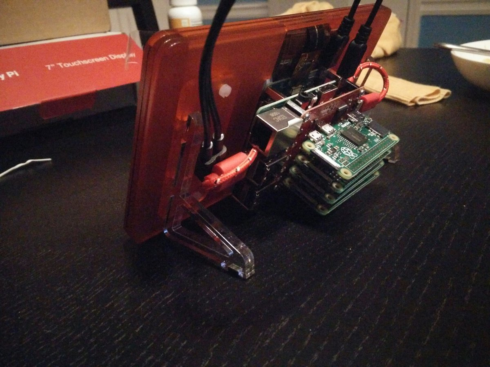
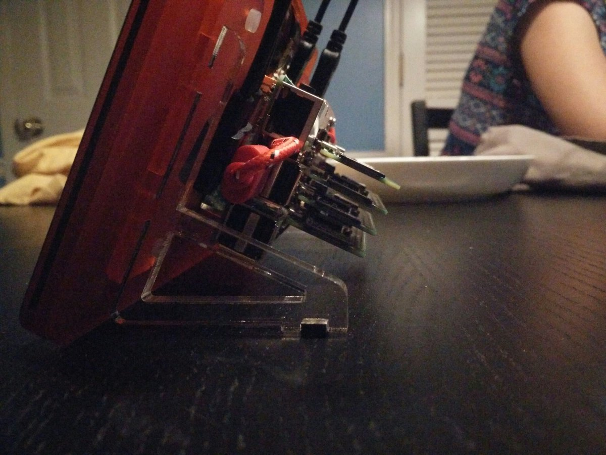
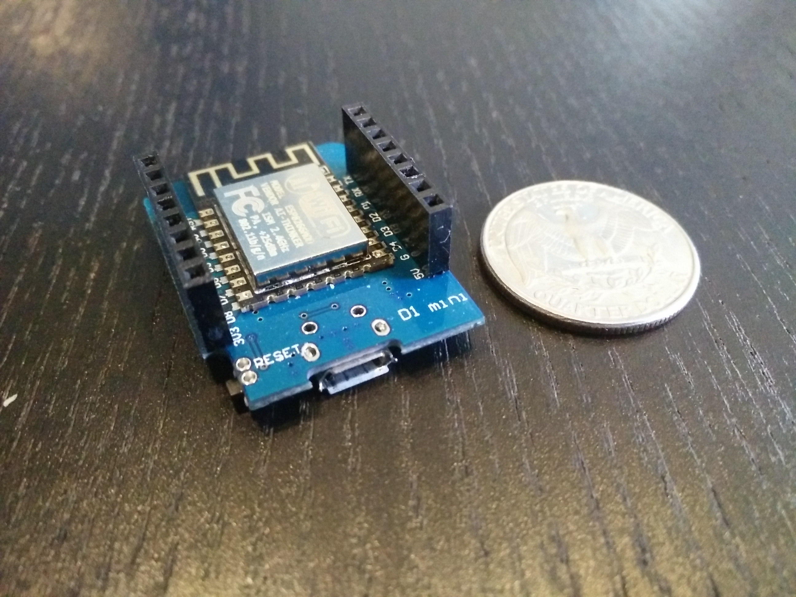
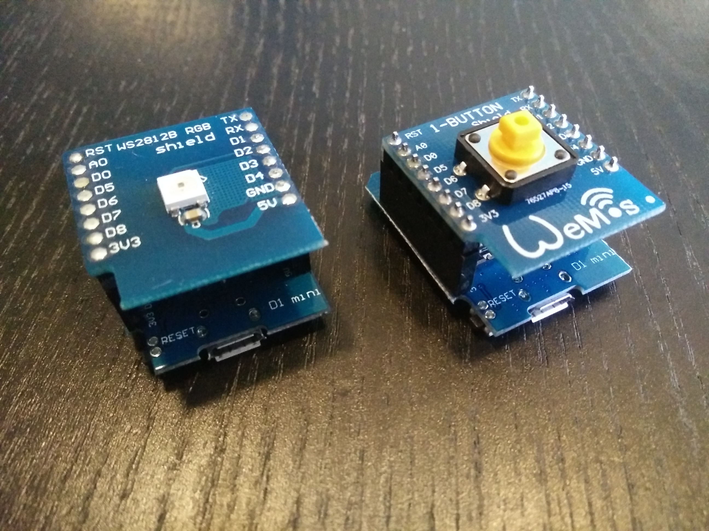

DC404 Show 'n Tell
------------------

*October 2016*

Matt

http://brimstone.github.io

Note: <a href="slides.html?talks/dc404-show-n-tell-2016-10.md#!">View this as slides</a>

Raspberry Pi Picture Frame
--------------------------

[project page](/projects/picluster/index.md)
- 1x Pi 3
- 4x Pi 0
- Screen from Pimonori
- bought with bitcoin

Challenges
----------
- want everything to be in docker
- including xorg
- xorg can't find the touchscreen sometimes

d1 mini
-------
- esp8266 microprocessors
- $2.5 !!!
- micropython
- MQTT
  - iot.eclipse.org:1883

pcd
---

[github project](https://github.com/brimstone/pcd)

- Hardened appliance for docker based workloads
- all static binaries
- no glibc, no openssl, no musl
- grsec kernel
- single file
- 25MB

Home automation
---------------
- z-wave
- MQTT
- homeassistant
- node-red

Meetups
-------
- JavaScript
- Docker
- Go
- Kubernetes

