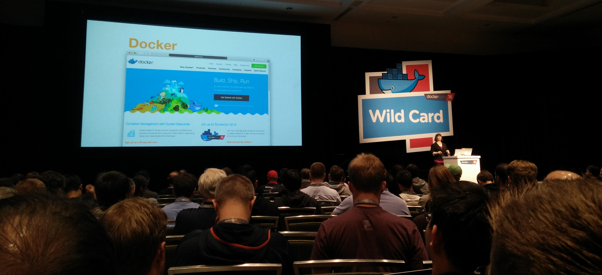
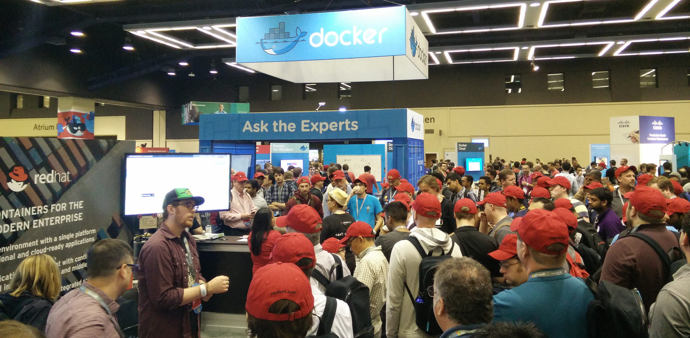
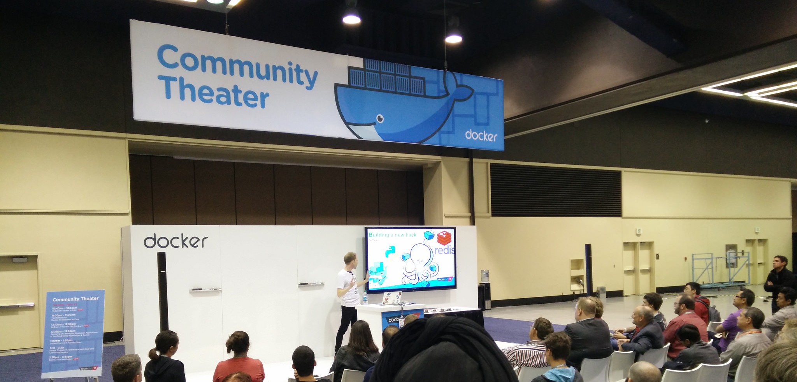
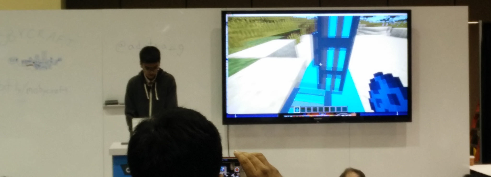

Dockercon16
-----------

June 20-21, 2016, Seattle

Note: <a href="slides.html?talks/dockercon16.md#!">View this as slides</a>
Link dump:
- http://www.slideshare.net/Docker/presentations/3?order=latest
- https://www.youtube.com/playlist?list=PLkA60AVN3hh9gnrYwNO6zTb9U3i1Y9FMY

But first
---------

<iframe width="853" height="480" src="https://www.youtube-nocookie.com/embed/KC9tJ7b3dww?start=4745&end=4947" frameborder="0" allowfullscreen></iframe>

Docker 1.12 News
----------------

- `HEALTHCHECK --interval=5m --timeout 30s ...`
  - developer can specify what it means for a container to be "healthy"
- swarm is now a first class citizen
  - scaling
  - TLS
- node failure recovery
  - orchestration will move the containers to a new node if a running node dies

- services as a first class citizen
  - declare a desired service state and let swarm deal with it:
  `docker service create --replicase 3 --name frontend --network mynet --publish 80:80/tcp frontend_image:latest`
  `docker service create --name redis --network mynet redis:latest`
  - DNS-based service discovery -- say "redis", it finds it on the overlay network
  - scaling: `docker service scale frontend=100`

  - global services - if there's container(s) you want running on *every* host:
  `docker serice create --mode-global --name-prometheus prom/prometheus`
  - constraints (via labels) - if you have containers that you only want to run on certain hosts:
  `docker daemon --label com.example.storage="ssh"` to label hosts with SSDs
  `docker service create mysql --constraining com.example.storage="ssd"`
    - if you try to oversubscribe a resource, it's fairly smart about it and won't schedule the containers

  - DABs - Distributed Application Bundles
    - A bundle of services that can declare the entire stack
    - Experimental in 1.12; file format is WiP (probably JSON generated by a compose file)

- container-aware routing mesh; load balancing built into Engine
- security
    - Crypotgraphic Node Identity
    - Workload segregation (think PCI)
    - TLS mutual auth and encryption; cert rotation

- plugin subcommands
    - `docker plugin install repo/plugin`
    - `docker plugin [enable|disable] $plugin`
    - Plugin Permissions Model - Plugin requests the perms it needs

Canned demo
-----------
- new employee
- compose up
- compose bundle into .DAB
- conversation with ops

John Willis
-----------
- Great talk but it was all over the place, try to find a video
- 97% of exploits come from 10 CVEs, most of those are >10 years old
- How many web/crypto/whatever frameworks are you using? It's probably too many
- Use fewer, better suppliers; use their highest quality parts; track which parts you use and where
- Immutable Infrastructure
- Deploy more often, shorter lead team, better resilience - the difference between high and low performing orgs

Riot Games
----------
- Talk from Riot Games (LoL) about their build process
- 1.25 million software builds/yr; 10-14k containers/day
- "Wouldn't it be awesome if devs could just hand over a dockerfile that defines their build jobs/environment?"
- Dockerfile for a build slave is big and does lots of things that are usually considered antipatterns (exposed SSH, multiple processes, multiple versions of same process to accomodate unit tests, etc)
- Automated Jenkins via Groovy: https://github.com/maxfields2000/dockerjenkins_tutorial

- Needed a way to verify images and inspect containers, created "harbormaster" tool
- Then devs wanted to start building Docker containers inside of their build containers (!), put "Drydock" tool into the mix
- Garbage collection via Spotify's docker-gc tool (on github)
- Lots more info: https://engineering.riotgames.com/news/building-jenkins-inside-ephemeral-docker-container

Sharding Containers
-------------------
- Computers are basically networks-on-a-chip
- Used Docker to pin containers to CPU cores
- Local loadbalancer to spawn and pin
- 65% gain for free, 133/220 req

Rancher demo
------------
- Pick a provider, Digital Ocean, AWS, bare metal
- Pick an orchestration, Cattle, Mesos, Swarm, Kubernetes

Moby's Cool Hacks
-----------------

- Cool demos
- Video up now

Failure as a service
- Project: Entropy
- Jerked around container network stack

Serverless with Docker
- Also a talk by Nirmal Mehta
- Each endpoint is a container that only lives for the live time of that request
- Also shown in Moby's cool hacks

Updating container on drone while it is flying
- Resin.io
- Git push based

1.12 Hackathon
--------------

Now through July 25

Criteria
--------

Fit: Does Docker improve the project or fundamentally enable it?

Efficiency: Is this implementation small in size, easy to transport, quick to start up and run?

Integration: Does the project fit well into other systems, or is it sufficiently complex itself to be its own system?

Transparency: Can other people easily recreate your project now that you’ve shown how? Is your code open source?

Presentation: How well did you present your project in the video? Does the video convey your hack clearly and do you cover all the important points?

Usefulness: Popular vote on how many would people would use your hack. So keep your audience in mind!

Longevity: Can the project be improved / built upon?

Bonus Points: Contributions and bug fixes to the Docker 1.12 Github repository

Prizes
------

1st place winners: MakerBot – Replicator Mini as well as five Docker Hub private Repositories and one Docker Cloud extra node.

2nd place winners: Apple Watch

3rd place winners: Oculus Rift

Sign up
-------

http://docker112.devpost.com/

http://tech404.io #docker
