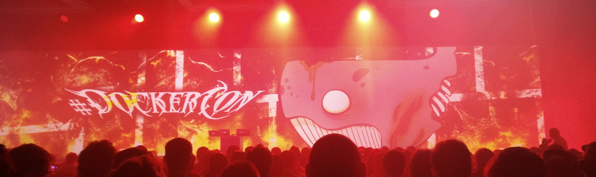
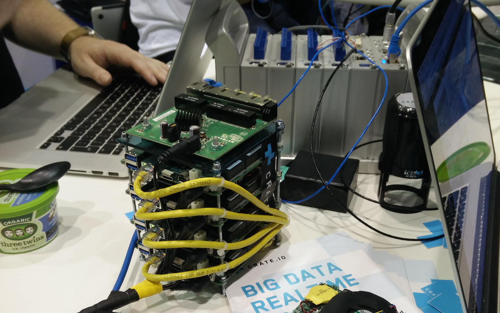

Dockercon16
-----------

July 20-21, 2016, Seattle

Note: <a href="slides.html?talks/dockercon16.md#!">View this as slides</a>
Link dump:
- http://www.slideshare.net/Docker/presentations/3?order=latest
- https://www.youtube.com/playlist?list=PLkA60AVN3hh9gnrYwNO6zTb9U3i1Y9FMY

Docker 1.12 News
----------------

- `HEALTHCHECK`
- swarm is now a first class citizen
  - scaling
  - TLS
- services as a first class citizen

John Willis
-----------

Riot Games
----------

Canned demo
-----------
- new employee
- compose up
- compose bundle into .DAB
- conversation with ops

Sharding Containers
-------------------
- Computers are basically networks-on-a-chip
- Used Docker to pin containers to CPU cores
- local loadbalancer to spawn and pin
- 65% gain for free, 133/220 req

Rancher demo
------------
- Pick a provider, Digital Ocean, AWS, bare metal
- Pick an orchestration, Cattle, Mesos, Swarm, Kubernetes

Moby's Cool Hacks
-----------------

- Cool demos
- Video up now

Failure as a service
- Project: Entropy
- Jerked around container network stack

Serverless with Docker
- Also a talk by Nirmal Mehta
- Each endpoint is a container that only lives for the live time of that request
- Also shown in Moby's cool hacks

Updating container on drone while it is flying
- Resin.io
- Git push based

