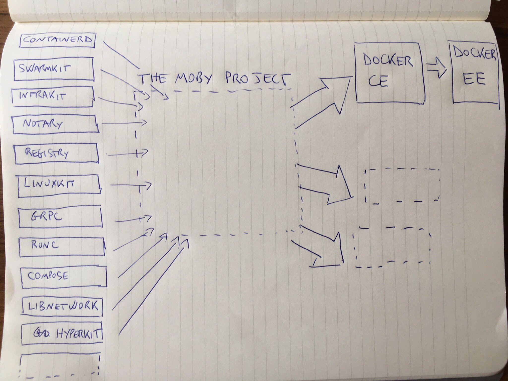
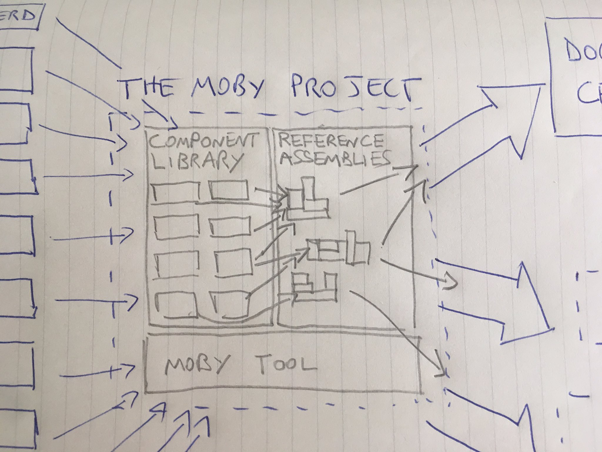

Dockercon17
-----------
Matt, Ben, Drew, Randall

About the conference and location
- ~5,000 attendees
- ~1,000(20%) women

Note: - https://twitter.com/solomonstre/status/854692761613852674

Moby Project
------------

Docker is, and will remain, a open source product that lets you build, ship and run containers. It is staying exactly the same from a user’s perspective. Users can download Docker from the docker.com website.

Note: https://mobyproject.org/#moby-and-docker

Moby is a project which provides a “Lego set” of dozens of components, the framework for assembling them into custom container-based systems, and a place for all container enthusiasts to experiment and exchange ideas.

Note: https://mobyproject.org/#moby-and-docker

New Docker Features
-------------------

Talks worth watching
--------------------

