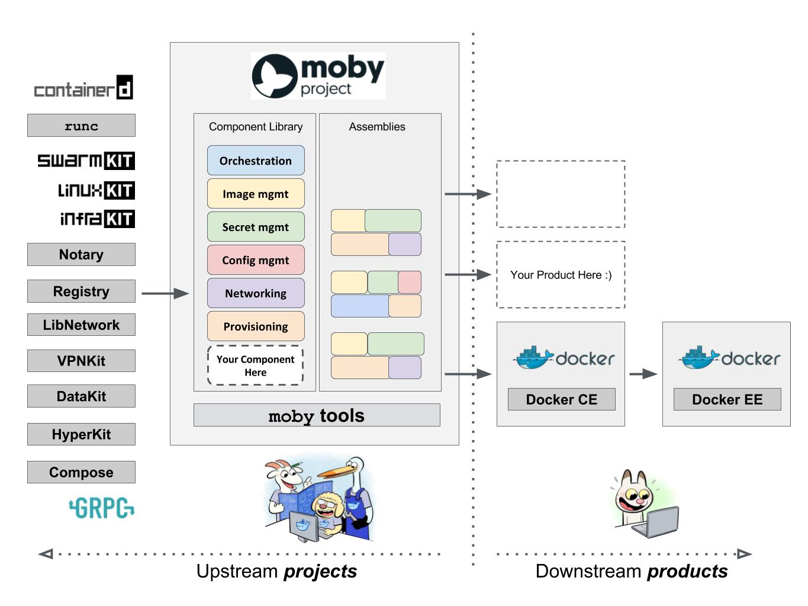
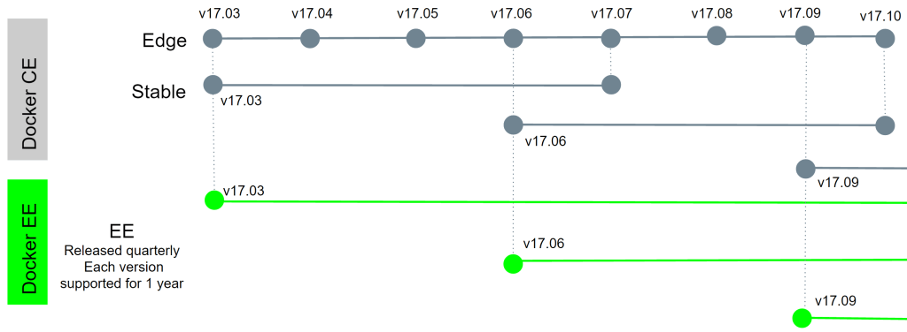

Dockercon17
-----------
Matt, Ben, Drew, Randall

https://brimstone.github.io

Note: <a href="slides.html?talks/dockercon17.md#!">View this as slides</a>


General
-------

- Austin, TX
- April 18-20, 2017
- ~5,000 attendees
- ~1,000(20%) women

Note: - Credit: https://twitter.com/solomonstre/status/854692761613852674


[Slides](http://www.slideshare.net/docker) and [Videos](https://www.youtube.com/playlist?list=PLkA60AVN3hh_nihZ1mh6cO3n-uMdF7UlV) online soon.


Moby Mingle
-----------
- One-on-few peer directed 
- Attendees can offer or request mingles with other attendees


Announcements
-------------


Moby Project
------------


Docker is, and will remain, a open source product that lets you build, ship and run containers. It is staying exactly the same from a user’s perspective. Users can download Docker from the docker.com website.

Note: Credit: https://mobyproject.org/#moby-and-docker


Moby is a project which provides a “Lego set” of dozens of components, the framework for assembling them into custom container-based systems, and a place for all container enthusiasts to experiment and exchange ideas.

Note: Credit: https://mobyproject.org/#moby-and-docker




Note: - Credit: https://twitter.com/solomonstre/status/855918630915133440
Credit: Docker Weekly #183: April 26th, 2017


Use cases for Moby
------------------
- linuxkit VM for Hyper-V
- docker deb and rpm
- projects like RancherOS
- docker-ee builds

Note: docker-ee can include more specific `help` commands that don't make sense in -ce


Moby TL;DR
----------
- The Docker Community Edition will still be free.
- Docker is now a consumer of code in the Moby Project, which is open source.
- The Docker CLI is not going away and will not being renamed moby. The moby CLI is used to manage components of the Moby Project.

Note: Credit: https://blog.codeship.com/dockercon-2017-recap/


Linuxkit
--------
A toolkit for building secure, portable and lean operating systems for containers.

https://github.com/linuxkit/linuxkit


Example config
--------------
```
kernel:
  image: "linuxkit/kernel:4.9.x"
  cmdline: "console=ttyS0 console=tty0 page_poison=1"
init:
  - linuxkit/init:63eed9ca7a09d2ce4c0c5e7238ac005fa44f564b
  - linuxkit/runc:b0fb122e10dbb7e4e45115177a61a3f8d68c19a9
  - linuxkit/containerd:18eaf72f3f4f9a9f29ca1951f66df701f873060b
services:
  - name: dhcpcd
    image: "linuxkit/dhcpcd:0d4012269cb142972fed8542fbdc3ff5a7b695cd"
    binds:
     - /var:/var
     - /tmp/etc:/etc
    capabilities:
     - CAP_NET_ADMIN
     - CAP_NET_BIND_SERVICE
     - CAP_NET_RAW
    net: host
  - name: redis
    image: "redis:3.0.7-alpine"
    capabilities:
     - CAP_NET_BIND_SERVICE
     - CAP_CHOWN
     - CAP_SETUID
     - CAP_SETGID
     - CAP_DAC_OVERRIDE
    net: host
outputs:
- format: kernel+initrd
```

Note: Credit: https://github.com/linuxkit/linuxkit/blob/master/examples/redis-os.yml


New Docker Features
-------------------

Given by Victor Vieux

Note: Quick Highlights follow


Version Change
--------------
1.13 -> 17.03



Note: - The next release after 1.13 is 17.03, note YY.MM, just like ubuntu
- This allows for regular monthly releases and cuts out scrambling to get features into the next release.
- Enterprise Edition will allow for extended support and the usual.


Data management commands (17.03)
--------------------------------
`docker system df`

`docker system prune`

Note: Use these to clean up space wasted by useless layers


Multi-stage builds (17.05)
--------------------------

```
$ cat Dockerfile
FROM golang:1.8 AS builder

COPY . /go/src/app

RUN go get -d -v

RUN go install -v

FROM scratch

COPY --from=builder /app /app

CMD ["/app"]

```

Note: - This is a huge savings for final images
- Multiple stages allowed, some examples of `base`, `dependences`, `test` and then final stages
- Other examples of how this is awesome: https://codefresh.io/blog/node_docker_multistage/


Build Args in tags (17.05)
--------------------------

```
$ cat Dockerfile
ARG GO_VERSION=latest

FROM golang:${GO_VERSION} AS builder

COPY . /go/src/app

RUN go get -d -v

RUN go install -v

FROM scratch

COPY --from=builder /app /app

CMD ["/app"]

```

```
$ docker build -t <repo>:<tag> --build-arg GO_VERSION=1.7 .
```

Note: Also fantastic


Swarm Service Features (17.04)
----------------------
- Commands can be synchronous with `--detach=false`
- Rollback options during failed deploys
  - pause (default)
  - continue
  - rollback


Talks worth watching
--------------------


General Sessions
----------------

- Day 1: Features and demos
- Day 2: Enterprise-focused


Moby's cool hacks
-----------------

[Video](https://www.youtube.com/watch?v=-h2VTE9WnZs)
- New features in Play With Docker
- [Functions as a service](http://getfaas.com)

Note: - PWD is really slick
- demo http://training.play-with-docker.com
- Faas is kinda like Lambdas + API Gateway


What have namespaces done for you today?
----------------------------------------
Liz Rice

- Builds a container from scratch
- Uses namespaces and cgroups
- Not difficult to understand
- Watch this demo


It takes a village
------------------
Jeff Lindsay

- Talks about open source communities
- Shell Scripts As A Service
```
$ echo '
#!cmd alpine bash curl jq
#!/bin/bash
curl -s "${1}" | jq -r "${2}"
' | ssh cmd.io :create http
```
```
$ ssh cmd.io http ipinfo.io .ip
184.73.99.3
```

- webhooks, etc

Note: - Super cool idea
- Not completely sold on the usefulness
- Seems more dev like than production


From ARM to Z
-------------
Christy Perez, Chris Jones

- demo building multi-arch images with go
- demo running a multi-arch image in a multi-arch swarm
- Docker for X can run images for different archs today!

Note: - From IBM, so their usecase is big iron
- Also a cool concept
- Allows me to build and test images for my rpi on my laptop
- Allows me to deploy images to a rpi/x64 hybrid swarm


Building Effective Images
-------------------------
Abby Fuller, AWS

- How do Layers work?
  - Layer overview
  - Reducing number of layers
  - Cache rules everything around me
  - Choose the right base
- Dockerfiles: The Good, the Bad, and the Bloated
  - Combine RUNs if you can
  - Do as much as you can in a single RUN block
  - Minimize switching USERs
  - Cleanup when you're done


- Language-specific
  - Where possible, use 2 image - one to build an artifact and one from base
  - GoLang:
    - Compile, THEN copy binary
    - Use `FROM scratch`
  - Ruby
    - Official images for Ruby are huge. A new base plus a little extra work pays off
  - NodeJS
    - .dockerignore npm-debug. Seriously.
    - Cache your node_modules (i.e. only run `npm install` if package.json changes
    - Use the new build stages


- Other Stuff
  - `docker image prune -a` or go even further with `docker system prune -a`
  - Cleanup anything you can, whenever you can


Troubleshooting Tips from a Docker Engineer
-------------------------------------------
Jeff Anderson, Developer Support @ Docker

- Characterization - define the problem
- Hypothesis - propose a solution
- Test & Observe

Note: -Some more detail on specific scenarios:
  - Volumes
  - Networking
  - TLS
- Advanced Troubleshooting Tools
  - socat
  - curl
  - jq
  - Regular networking tools (iptables, ipvsadm, route, ip, arp, tcpdump, ifconfig)
  - nsenter (https://github.com/jpetazzo/nsenter)


Container Performance Analysis 
-------------------------------------------
Brendan Gregg, Netflix

- Good overview of the tools and approaches to profiling containers
- Dense reference material in slides
- USE method: (utilization, saturation, errors)
- useful flowchart for understanding cpu bottlenecks on containers (including cpu share)

Slides: https://www.slideshare.net/brendangregg/container-performance-analysis
Video: https://www.youtube.com/watch?v=bK9A5ODIgac


Moby Project Summit
-------------------
- General Q&A about moby project
- Discussion about CNCF
- Progress updates from each component, containerd, swarmkit, libnetwork, notary, infrakit, infinit, Mirageos
- Recorded, worth watching to know more
