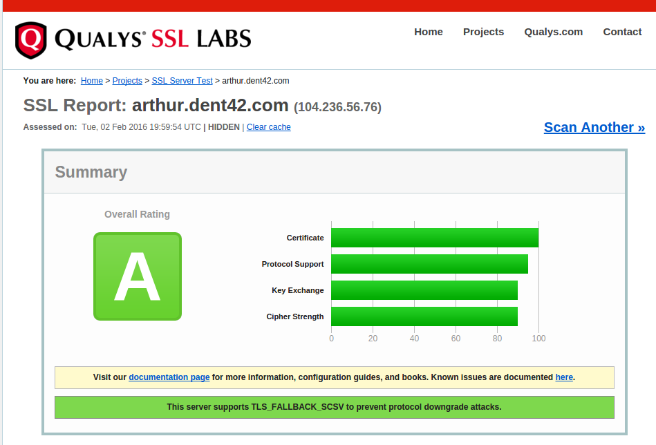

Go, Let's Encrypt, and the Perfect Score
----------------------------------------
Matt

@brimston3

https://brimstone.github.io

Note: <a href="../slides.html?talks/go-le-score.md#!">View this as slides</a>
- Who has heard of Let's Encrypt?
- Who has use Let's Encrypt?
- Who has heard of Qualys?


Go
---


- Rob Pike, Ken Thompson, and Robert Griesemer
- Announced on November 10, 2009
- Staticly compiled language
- Easy to use
- Concurrent

Note: Because of Go's concurrency, it's great for web servers
Because of Go's natural static compilation, it's great for docker containers.


Let's Encrypt
-------------


- Free SSL CA
- Launched in April 12, 2016
- domain-validation certs only
- no wildcards
- Root cert signed by IdenTrust
- Certs only last for 90 days


ACME
----
- Automated Certificate Management Environment
- Server: [boulder](https://github.com/letsencrypt/boulder)
  - Go
- Client: [certbot](https://github.com/certbot/certbot)
  - Python

Note: ACME is the protocol Let's Encrypt is using to sign certs
To get your own certs signed by Let's Encrypt, just use certbot
Use cron to keep certs updated


Qualys SSL Labs
---------------


- de facto standard for client/server ssl testing
- (hey, show the [demo](https://www.ssllabs.com/ssltest/))
- Four aspects
  1. Certificate
  2. Protocol Support
  3. Key Excahnge
  4. Cipher Strengh
- Grades against industry best practices, DH, TLS 1.2, etc


Why?
----
I host my own email and websites.

I only had 90 days until my certs expire!

Over engineering is fun!


dkumor/acmewrapper
------------------

https://github.com/dkumor/acmewrapper

```
w, err := acmewrapper.New(acmewrapper.Config{
    Domains: []string{"example.com","www.example.com"},
    Address: ":443",
    TLSCertFile: "cert.pem",
    TLSKeyFile:  "key.pem",
    RegistrationFile: "user.reg",
    PrivateKeyFile:   "user.pem",
    TOSCallback: acmewrapper.TOSAgree,
})
if err!=nil {
    log.Fatal("acmewrapper: ", err)
}
listener, err := tls.Listen("tcp", ":443", w.TLSConfig())
```


Certs needed for
----------------
- smtp
- imap
- owncloud
- (as well as the root domain)


Complications
-------------


Everything is dockerized
------------------------
- Even on one host
- certs in volumes


Previous attempt
----------------
- data volume with certs
  - apache-ssl, exim-ssl, dovecot-ssl
- bash script configured apache using consul


Current version
---------------
https://github.com/brimstone/go-le-proxy

```
docker run --rm -it \
    -p 443:443 \
    -e BASE_DOMAIN=example.com \
    -e PROXY_subdomain=http://10.0.0.2:8080 \
    -v $PWD/www:/www:ro \
    -w /www \
    brimstone/go-le-proxy
```
- https://example.com => /www
- https://subdomain.example.com => http://10.0.0.2:8080
- https://example.com/subdomain => http://10.0.0.2:8080


Go 1.6 Score
------------



Perfect Score
-------------
https://blog.bracelab.com/achieving-perfect-ssl-labs-score-with-go


Current Score
-------------


[live demo](https://www.ssllabs.com/ssltest/analyze.html?d=the.narro.ws&hideResults=on)


Caddy
-----
[caddyserver.com](https://caddyserver.com/)
- Let's Encrypt
- Proxy
- Markdown
- FastCGI


Bonus content!
--------------

http://xip.io

http://nip.io

https://crt.sh/?Identity=%25.xip.io
