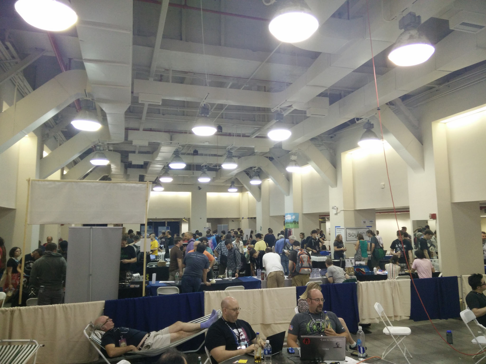

HOPE XI
-------

Matt

brimstone.github.io

July 22-24 2016, New York City

Note: <a href="slides.html?talks/hope.xi.md#!">View this as slides</a>

The Eleventh HOPE will take place on July 22, 23, and 24, 2016 at the Hotel Pennsylvania in New York City. H.O.P.E. stands for *Hackers On Planet Earth*, one of the most creative and diverse hacker events in the world. *It's been happening since 1994*.

Note: There you'll find:
- hackerspace villages
- film screenings
- Segway rides
- lock picking villages
- art installations
- live video streams
- vintage computers
- robots
- an amateur radio station
- electronics workshops
- and the country's biggest supply of Club-Mate

Didn't stay in hotel penn this year, an AirBnB around the corner.

Joke about 2,600 people.

A lot of the same DefCon crowd.

Wide range of topics:
- Information Security
- Hacker Culture
- Puzzle
- CTF
- Political Activism

Note: Dangerously close to hacktivism

Wide range of talks:
- Starting a hackerspace in China
- Vulnerability Disclosure
- Let's Encrypt
- TOR
- Starting Cryptoparties
- Sounds of Pirate Radio in NYC
- Mesh VPNs (tinc!)
- Data Stealing Monoliths
- Exocortices
- Ransomware

Note: Mention the 'zines being passed around

Wide range of presentors:
- Cory Doctrow
- RMS
- Jason Scott
- Steve Rambam
- Comet Crowbar

Note: Mention the crazies. They're extreme, but nice people.

Note: "hacking" has a pretty broad definition.

Note: TOOOL also at defcon

EFF CTF
-------
- Stegenography
- Brainf*ck
- SQL injections
- terrible crypto

Note: I think I can get puzzles still. There's a writeup too:

- Videos streamed by Internet Society
- 10G bandwidth
- 4 planned talk tracks
- 1 ad-hoc talk track
- 3 workshop rooms

Questions?
----------
