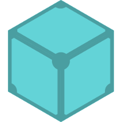
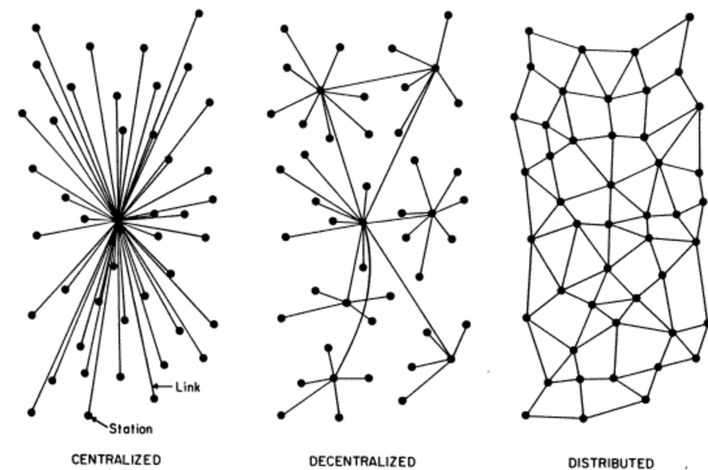
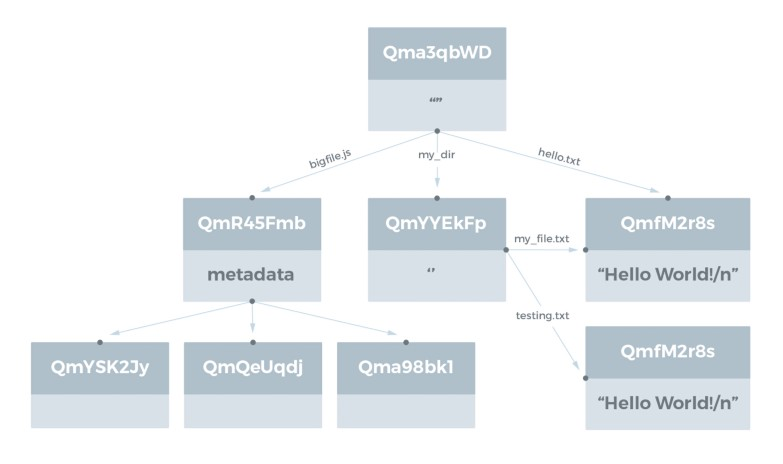

Introduction to IPFS
--------------------



Matt - @brimston3

https://ipfs.io

http://blog.in.the.narro.ws

QmRYdsLqqMCUfAskVKapk296yRTmvJ4CKi5SumihH8gmj2

<div style="clear: both"></div>

Note: - <a href="../slides.html?talks/ipfs-intro.md#!">View this as slides</a>
- [ConsenSys description](https://medium.com/@ConsenSys/an-introduction-to-ipfs-9bba4860abd0)


Protocol Labs, Inc.
-------------------

http://ipn.io

- IPFS
- [Filecoin](http://filecoin.io)
- [White Paper](https://github.com/ipfs/papers/raw/master/ipfs-cap2pfs/ipfs-p2p-file-system.pdf)

Note: IPFS development is sponsored by Protocol Labs, formerly Interplanetary Networks.


> The InterPlanetary File System (IPFS) is a new hypermedia distribution protocol, addressed by **content** and **identities**. IPFS enables the creation of completely **distributed** applications. It aims to make the web faster, safer, and more open. — https://ipfs.io

Note: - The big keyword here is distributed.




Note: - It's important to keep these three concepts in mind and separate.
- The internet was first designed with the paradigm of sending a message to a remote server and getting back a response.
- HTTP is Decentralized by nature, not Distributed
- Plus, it's a neat picture.


What is it?
-----------

- BitTorrent / Git
- Versioned File Systems
- Merkle DAG

Note: - To understand IPFS, one must first understand the components.
- "IPFS could be seen as a single BitTorrent swarm, exchanging objects within one Git repository." — White paper
- "In other words, IPFS provides a high throughput content-addressed block storage model, with content-addressed hyper links." — White paper
- It's a versioned filesystem
- It's really a Merkle DAG structure


Pass by …
---------

HTTP: Pass by reference

IPFS: Pass by value

Note: - We need to think about HTTP as pass by reference, ask for the content at this url at this time.
- While IPFS is pass by value, ask for the content described by this hash, I don't care from where.
- Why should you go across the planet for something when we have high enough speed links between us now, you could just get the contents from your neighbor.
- How do you know the content your neighbor says they have is the content you want?
- That's where the Merkle DAG steps in.


Merkle Trees
------------
- Ralph C. Merkle
- [US Patent 4309569](https://www.google.com/patents/US4309569) in 1979


Note: Merkle DAG is based on Merkle Trees


> In cryptography and computer science, a hash tree or Merkle tree is a tree in which every non-leaf node is labelled with the hash of the labels or values (in case of leaves) of its child nodes. — [Wikipedia](https://en.wikipedia.org/wiki/Merkle_tree)

Note: This is the exact opposite of git and blockchains.




Note: - You can see how the parent nodes point at the child nodes they contain.
- Look at the files
- Look at the directories of files
- Look at the big files which are composed of smaller blocks. Looks like bittorrent, right?
- Look at the multihashes, this is how content is identified.


Multihash
---------
https://github.com/jbenet/multihash

```
<1-byte hash func code><1-byte digest size in bytes><hash func output>
```

```
fn code  dig size hash digest
-------- -------- ------------------------------------
00010001 00000100 101101100 11111000 01011100 10110101
sha1     4 bytes  4 byte sha1 digest
```

Note: - Also same creator as IPFS, but other people, like Google, have implementations.


Example Multihashs
------------------

```
# sha1 - 0x11
11140beec7b5ea3f0fdbc95d0dd47f3c5bc275da8a33 # sha1 in hex
24a0qvp7pqn3y3yvt5egvn3z7hdw4xeuh8tg # sha1 in base32
5dqx43zNtUUbPj97vJhpHyUUPyrmXG # sha1 in base58
ERQL7se16j8P28ldDdR/PFvCddqKMw== # sha1 in base64

# sha2-256 0x12
12202c26b46b68ffc68ff99b453c1d30413413422d706483bfa0f98a5e886266e7ae # sha2-256 in hex
28g2r9nmddmfzhmfz6dmaf0x610k84u25nr690xzm3wrmqm8c9kefbg # sha256 in base32
QmRJzsvyCQyizr73Gmms8ZRtvNxmgqumxc2KUp71dfEmoj # sha256 in base58
EiAsJrRraP/Gj/mbRTwdMEE0E0ItcGSDv6D5il6IYmbnrg== # sha256 in base64
```

Note: Things that make Base58 cool:
- Doesn't have to be byte aligned
- Doesn't use confusing letters


Installation
------------

- Prebuilt binaries
  - https://gobuilder.me/github.com/ipfs/go-ipfs/cmd/ipfs?branch=release
- From source

```
$ go get -d github.com/ipfs/go-ipfs
$ cd $GOPATH/src/github.com/ipfs/go-ipfs
$ make install
```

Note: This is a single go binary
- It used to be simple to install, now needs a little bit more
- Using GX, which is a great topic for later


Initialize keys
---------------

```
$ ipfs init
initializing ipfs node at ~/.ipfs
generating 2048-bit RSA keypair...done
peer identity: Qma892V56Pk7FEns9XmwC9t2sUUNm2gijzVf1B2JBTzJBU
to get started, enter:

        ipfs cat /ipfs/QmYwAPJzv5CZsnA625s3Xf2nemtYgPpHdWEz79ojWnPbdG/readme
```

Note: - No options needed
- Local public key is displayed also, but can be obtained later with `ipfs id`


Start Daemon
------------

```
$ ipfs daemon
Initializing daemon...
Swarm listening on /ip4/1192.168.1.100/tcp/4001
Swarm listening on /ip4/127.0.0.1/tcp/4001
API server listening on /ip4/127.0.0.1/tcp/5001
Gateway (readonly) server listening on /ip4/127.0.0.1/tcp/8080
Daemon is ready
```

Note: - Swarm on 4001/tcp - open those ports
- API server on 5001/tcp on localhost - keep this protected
- Gateway 8080/tcp on localhost - should be save to open to the world
- The daemon is running locally, but talking to other peers


Adding Content
--------------

```
$ echo 'Hello IPFS!' | ipfs add
added QmYWAifyw2V5dEq7c5GgdSPffeKoYXQZggnYzw5RbXpig4 QmYWAifyw2V5dEq7…
```

Note: - Super simple
- Content is chunked up
- A multihash is created and returned
- These hashes are immutable and cannot be changed


Retrieving Content
------------------

```
$ ipfs cat QmYWAifyw2V5dEq7c5GgdSPffeKoYXQZggnYzw5RbXpig4
Hello IPFS!
```

Note: Also super simple


Retrieving Content with a browser
---------------------------------

http://localhost:8080/ipfs/QmYWAifyw2V5dEq7c5GgdSPffeKoYXQZggnYzw5RbXpig4

Note: - Again, straight forward
- But what if we want friends to get our content and they don't have ipfs installed?


Retrieving Content without a local proxy
----------------------------------------

https://ipfs.io/ipfs/QmYWAifyw2V5dEq7c5GgdSPffeKoYXQZggnYzw5RbXpig4

Note: - ipfs.io is actually an array of publicly maintained daemons
- But what if you want to add multiple files?


Adding a directory
------------------

```
$ ipfs add -r .
added QmYWAifyw2V5dEq7c5GgdSPffeKoYXQZggnYzw5RbXpig4 ipfs/hello.txt
added QmSPBPzYX1XaKFZG6BkcAwmUyNxqN3yW9MnMzQBCi3Qsup ipfs
```

Note: - This took place inside a directory called ipfs, but I added "."
- Notice our hash from earlier. The file has exactly the same contents as before.
- This shows the deduping taking effect, because multihashes point to multihashes or blocks of content


Retrieving a directory with a browser
-------------------------------------

http://localhost:8080/ipfs/QmSPBPzYX1XaKFZG6BkcAwmUyNxqN3yW9MnMzQBCi3Qsup 


Permanent web
-------------

```
$ ipfs pin ls
QmSPBPzYX1XaKFZG6BkcAwmUyNxqN3yW9MnMzQBCi3Qsup recursive
QmYWAifyw2V5dEq7c5GgdSPffeKoYXQZggnYzw5RbXpig4 recursive
```

Note: - This is where the "permanent web" is exposed.
- You can see both the content added earlier and the directory listed as pinned.


Deleting
--------

```
$ ipfs pin rm QmYWAifyw2V5dEq7c5GgdSPffeKoYXQZggnYzw5RbXpig4
```

Note: - Our content was "pinned" before, when we added it
- Deleting isn't what you'd expect. Think of it as more not remembering


More not remembering
--------------------
```
$ ipfs repo gc
```

Note: - This actually removes the content, blocks, etc from the local system
- This doesn't remove it from other people's systems.
- If someone else pinned or even fetched content, someone else could get to it.


What else can be done?
----------------------
- IPNS
- dnslink
- unhosted apps
- This presentation
- Neocities

Note: - Daemon is talking to other peers
- https://ipfs.io/ipfs/QmUftM9MnmDrTGUZDXuexd9atArKEzSqQYjQP5Xt3oCvwx/exportedsites.html
