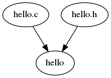

GNU Make: A 42 year old build tool
----------------------------------
Matt (brimstone)

[twitter.com/brimston3](https://twitter.com/brimstone3)

[mastodon.social/@brimstone](https://mastodon.social/@brimstone)

[brimstone.github.io](https://brimstone.github.io)

Note: <a href="../slides.html?talks/make.md#!">View this as slides</a>


Overview
--------
Make is a build automation tool that automatically builds executable programs
and libraries from source code by reading files called Makefiles which specify
how to derive the target program. Besides building programs, Make can be used to
manage any project where some files must be updated automatically from others
whenever the others change.

Note: - This is the text in the program and on the website.
- Don't read this. They can read it themselves.


_Make can be used … where some files must be updated automatically … whenever …
others change._

Note: - Instead say something like:
- This is tool primarily used in building software.
- make can be used more generally to automate software


Stuart Feldman
--------------
- Wrote make in April 1976
- Author of the first Fortran 77 compiler
- Part of the original group at Bell Labs that created the Unix operating system.
- Wrote it in a weekend

Note: More on his [wikipedia page][stuart-feldman].
[stuart-feldman]: https://en.wikipedia.org/wiki/Stuart_Feldman


Notable Early Features
----------------------
- Inclusion in early versions of UNIX made it widespread
- Configured via Makefile
- "Makefiles were text files, not magically encoded binaries, because that was
  the Unix ethos: printable, debuggable, understandable stuff." - _Stuart Feldman_
- Basically shell scripting


How make Works
--------------
1. Compare modification times of dependencies
2. Run only needed commands to rebuild artifacts

Note: - Can be described as a dependency graph.
- Build a graph of dependencies, then only rebuild what's changed in the graph
  since last time.


Graph
-----



Popular Derivatives
-------------------
1. GNU Make (gmake)
2. BSD Make (pmake)

Note: - Most popular is gmake
- pmake is popular on BSD systems
- Always more on [wikipedia][make-derivatives]
[make-derivatives]: https://en.wikipedia.org/wiki/Make_(software)#Derivatives


Manual Online
-------------
https://www.gnu.org/software/make/manual/


Makefiles
---------
- Conventionally named `Makefile`
- Plaintext
- Whitespace significant files
- Declaritive

Note: - Also, `makefile` and a few other names work.
- Don't need to be executable
- Don't need a #! line at the top


Basic Syntax
------------
```
[variable] = [value]

[target]: [components…]
[tab][command 1]
      …
[tab][command n]
```

Note: - Variables first, then targets
- rules for each target must be indented with a single tab.


Basic Example
-------------
Makefile:
```
hello: hello.c
    gcc -o hello hello.c
```

Terminal:
```
$ ls
hello.c Makefile
$ make
gcc -o hello hello.c
$ ls
hello hello.c Makefile
```

Results in a `hello` binary from the `hello.c` source file.

Note: - Does everyone understand this gcc syntax?
- `-o` means output, next parameter is the output file
- other unnamed parameters are source files
- Any questions before we continue?


Conventions
-----------
- Variables at the top
- `.DEFAULT_GOAL` or first target is default
- Default target is usually `all`
- `build` may also build things
- `clean` target cleans up everything that `all` did
- `distclean` restores to fresh checkout or uncompress


Advanced Example
----------------
```
include common.mk             # Another Makefile
CC=gcc                        # Compiler
CFLAGS=-I.                    # Compiler flags
DEPS = hellomake.h            # Other dependancy
OBJ = hellomake.o hellofunc.o # Interrum object files
BINARY ?= hellomake           # Name of binary
PREFIX ?= /usr/local          # Install location

.PHONY: all                   # All doesn't do anything
all: $(BINARY)

%.o: %.c $(DEPS)              # Wildcards match OBJs
	$(CC) -c -o $@ $< $(CFLAGS)

$(BINARY): $(OBJ)             # Variable target
	$(CC) -o $@ $^ $(CFLAGS)

.PHONY: install
install:
	@echo "Installing $(BINARY) into $(PREFIX)/bin/$(BINARY)
	@cp $(BINARY) $(PREFIX)/bin/$(BINARY)

uninstall:
	@echo "Removing $(BINARY)"
	-@rm $(PREFIX)/bin/$(BINARY) # Expected from install target
	-@rm $(PREFIX/bin/hello      # Previous versions
```

Note: - There's a lot going on in this example
- assignment
  - `=` direct assignment
  - `?=` assignment if unassigned, easy to overwrite with environment variables
- .`PHONY` Ignore the artifact and always process this target
- [Automatic Variables]
  - $@: target name
  - $<: first prerequisite
  - $^: All prerequisites
- Rule prefixes
  - `-` ignores failures, pretends it passes
  - `@` hides the output
[Automatic Variables]: https://www.gnu.org/software/make/manual/html_node/Automatic-Variables.html


Tricks
------


Dynamic help
------------
```
SHELL = /bin/bash

#HELP help Prints this help message.
.PHONY: help
help:
    @echo "Targets:"
    @echo ""
    @sed -n '/^#HELP/s/#HELP //p' Makefile \
	| sed 's/ /\t/' \
	| column -t -s $$'\t'
```


Exporting Variables
-------------------
```
export LOG_LEVEL ?= debug
.PHONY: run
run:
	./process
```

Note: Probably want to make sure to use `?=` here


Parallel Builds
---------------
```
make -j4
```
```
make -j$(nproc) -o
```

Force Unparallel
----------------
```
.NOTPARALLEL: locking-target
```

Note: Output could get jumbled unless you use `-o`


Dynamic Targets
---------------
```
.PHONY: uplink_%
uplink_%:
	GOOS=$(word 2, $(subst _, ,$@)) \
	GOARCH=$(word 3, $(subst _, ,$@)) \
	COMPONENT=uplink $(MAKE) binary

COMPONENTLIST := uplink satellite storagenode
OSARCHLIST    := linux_amd64 windows_amd64 darwin_amd64
BINS := $(foreach C,$(COMPONENTLIST),$(foreach O,$(OSARCHLIST),$C_$O))
.PHONY: binaries
binaries: ${BINS}
```


entr
----

_run arbitrary commands when files change_

```
watch:
	find . -type f | entr make build
```

Note: I love entr.
- Can be installed with apt, probably brew.
- Now my files are rebuilt when their source changes, automagically.


Hugo
----
TODO
