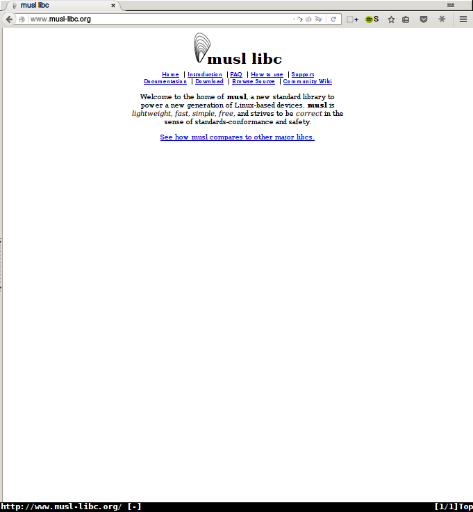
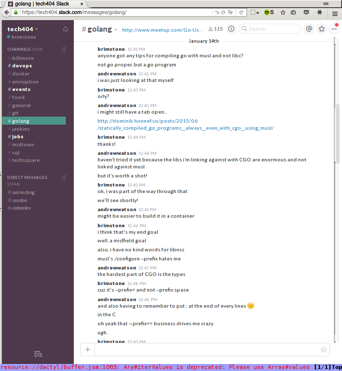

Truly Static Binaries with Go
-----------------------------
Matt

@brimston3

http://brimstone.github.io

Note: <a href="../slides.html?talks/musl-go.md#!">View this as slides</a>
- Who knows go builds static binaries?
- Who has used cgo?
- Who has used docker?
- also a good read: http://dave.cheney.net/2016/01/18/cgo-is-not-go


History
-------


Hub.docker.com
--------------


Note: - Who's setup a Automated Build on the Docker hub?
- Link to GitHub repo
- `git push` -> `docker pull`


Dockerfile
----------
```
FROM golang:onbuild
```

Note: container for this, super cool


```
$ docker build …
Sending build context to Docker daemon 164.4 kB
Step 1 : FROM golang:onbuild
onbuild: Pulling from library/golang
…
# Executing 3 build triggers...
Step 1 : COPY . /go/src/app
Step 1 : RUN go-wrapper download
 ---> Running in 8c8e5fa8b404
+ exec go get -v -d
Step 1 : RUN go-wrapper install
 ---> Running in d2f233c4c5aa
+ exec go install -v
app
 ---> 19d1e224608d
```

Note: downside: bring everything with you


Results
-------
```
REPOSITORY  TAG      IMAGE ID      CREATED      VIRTUAL SIZE
golang      onbuild  6b10dfd0c832  2 days ago   725.1 MB
helloworld  latest   19d1e224608d  2 hours ago  727.5 MB
```
Note: !!!


There has to be a better way
----------------------------


Note: This is an easter egg for those of you reading along ;)


Travis-ci
---------


Note: - searching around, other projects seem to use travis-ci
- looks like it'll give me the same work flow, `git push` -> `docker pull`


Test Project
------------
http://github.com/brimstone/docker-static


Note: so I made a project to test this out and investigate if this was possible


main.go
-------
```
package main

import "log"

func main() {
	log.Println("hello world!")
}
```

Note: could be made simpler with println()


.travis.yml
-----------
```
language: go

sudo: required
services:
 -  docker

script:
  - make
```

Note: sudo: isn't required, actually


Aside: default
--------------
```
package main

func main() {
	println("Hello!")
}
```
```
not a dynamic executable
```

Note: Go will try to build a static binary, if it can.


Aside: netgo example
--------------------
```
package main

import (
	"io/ioutil"
	"net/http"
	"os"
)

func main() {
	resp, err := http.Get("http://ip.appspot.com")
	if err != nil { println(err); os.Exit(1); }
	defer resp.Body.Close()
	body, err := ioutil.ReadAll(resp.Body)
	if err != nil { println(err); os.Exit(1); }
	println(string(body))
}
```

Note: Simple http get, nothing special


Aside: netgo default
--------------------
```
go build http.go
```
```
linux-vdso.so.1 (0x00007ffc159d7000)
libpthread.so.0 => /lib/x86_64-linux-gnu/libpthread.so.0 (0x00007f70c…
libc.so.6 => /lib/x86_64-linux-gnu/libc.so.6 (0x00007f70c9b3a000)
/lib64/ld-linux-x86-64.so.2 (0x000056216d358000)
```

Note: This causes linking against libc


Aside: netgo tag
----------------
```
go build -tags netgo http.go
```
```
not a dynamic executable
```

Note: This only fixes DNS requests


Makefile
--------
```
.PHONY: all build docker-image docker-push

all: build docker-image docker-push

build:
	go get -v -d
	CGO_ENABLED=0 go build -a -installsuffix cgo -ldflags '-s' -o main

docker-image:
	docker build -t brimstone/static .

docker-push:
	@[ -f ${HOME}/.dockercfg ] || docker login -e="${DOCKER_EMAIL}" \
		-u="${DOCKER_USERNAME}" -p="${DOCKER_PASSWORD}"
	docker push brimstone/static
```

Note: - Walk through each target really fast
- Mention hidden secrets
- this was the previous cgo command to make static


Dockerfile
----------
```
FROM scratch

CMD []
ENTRYPOINT ["/main"]

ADD main /
```

Note: Dockerfile is now 4 lines instead of 1


Result
------
```
❯ ls -lh main
-rwxr-xr-x 1 brimstone brimstone 1.6M Jan 16 12:29 main*
```
```
REPOSITORY        TAG      IMAGE ID      CREATED        VIRTUAL SIZE
brimstone/static  latest   a1d5db3d5851  13 seconds ago 1.672 MB
```

Note: - success!
- Now you have the history


Original Goal
-------------


Note: - swarm + compose at work is lacking
- like everything else made by hashicorp except vagrant, it's written in go
- take the same route


Dragons
-------
```
2016/01/16 20:26:55 [DEBUG] client: updated allocations at index 8 (1 
allocs)
2016/01/16 20:26:55 [DEBUG] client: allocs: (added 1) (removed 0) (upd
ated 0) (ignore 0)
2016/01/16 20:26:55 [DEBUG] client: starting runner for alloc '2ad66df
f-b902-f359-f2c1-bb434704b155'
2016/01/16 20:26:55 [WARN] client: failed to build task directories: u
ser: lookup username nobody: no such file or directory
2016/01/16 20:26:55 [DEBUG] client: updated allocations at index 10 (1
 allocs)
2016/01/16 20:26:55 [DEBUG] client: allocs: (added 0) (removed 0) (upd
ated 1) (ignore 0)
```

Note: - Almost, but no cigar
- Why? to drop privileges for security
- Should be easy enough to debug right?


Rabbit hole
-----------


Note: this should have been a red flag


user.Lookup()
-------------
```
…
if lookupByName {
	nameC := C.CString(username)
	defer C.free(unsafe.Pointer(nameC))
	// mygetpwnam_r is a wrapper around getpwnam_r to avoid
	// passing a size_t to getpwnam_r, because for unknown
	// reasons passing a size_t to getpwnam_r doesn't work on
	// Solaris.
	rv = C.mygetpwnam_r(nameC,
		&pwd,
		(*C.char)(buf),
		C.size_t(bufSize),
		&result)
	if rv != 0 {
		return nil, fmt.Errorf("user: lookup username %s: %s", usern…
…
```

Note: Because of this code, I can't disable cgo


Can I just short it?
--------------------
https://en.wikipedia.org/wiki/Userid#Special_values

Linux: 2^16−2 = 65,534

OpenBSD: 2^15-1 = 32,767

Note: no


getpwnam
--------
```
#include <pwd.h>
#include <stdio.h>

int main( void )
{
        struct passwd *pwd = getpwnam( "nobody" );

        if (pwd) {
                printf( "uid is: %d\n", pwd->pw_uid );
				return 0;
		}
        else{
                printf( "error\n" );
				return 1;
		}
}
```

Note: - stole this from someone online.
- object to compile it statically, just to see what's up


getpwnam
--------
> getpwnam.c:(.text+0xe): warning: Using 'getpwnam' in statically linked applications requires at runtime the shared libraries from the glibc version used for linking

Note: should have been second red flag


strace
------
```
❯ strace -e open ./getpwnam
open("/etc/nsswitch.conf", O_RDONLY|O_CLOEXEC) = 3
open("/etc/ld.so.cache", O_RDONLY|O_CLOEXEC) = 3
open("/lib/x86_64-linux-gnu/libnss_compat.so.2", O_RDONLY|O_CLOEXEC) …
open("/lib/x86_64-linux-gnu/libnsl.so.1", O_RDONLY|O_CLOEXEC) = 3
open("/lib/x86_64-linux-gnu/libc.so.6", O_RDONLY|O_CLOEXEC) = 3
open("/lib/x86_64-linux-gnu/ld-linux-x86-64.so.2", O_RDONLY|O_CLOEXEC…
open("/etc/nsswitch.conf", O_RDONLY|O_CLOEXEC) = 3
open("/etc/ld.so.cache", O_RDONLY|O_CLOEXEC) = 3
open("/lib/x86_64-linux-gnu/libnss_nis.so.2", O_RDONLY|O_CLOEXEC) = 3
open("/lib/x86_64-linux-gnu/libnss_files.so.2", O_RDONLY|O_CLOEXEC) =…
open("/etc/passwd", O_RDONLY|O_CLOEXEC) = 3
uid is: 65534
+++ exited with 0 +++
```

Note: shout out to my homie libnss!


Alternative route
-----------------

- Run as not uid 0
- can't open /var/run/docker.sock

Note: owner is root, group is docker, 128


Alternative route 2
-------------------

- Wrapper script
- check `$DOCKER_HOST` for unix:// prefix
- stat /var/run/docker.sock
- make /data directory owned by this user
- change to this account

Note: maintenance nightmare


Note: amirite?


altroute3 best altroute
-----------------------

Note: ask who's used a different libc?


musl
----



Note: - used in openwrt
- alpine linux?


Tech404
-------

http://tech404.io


Note: sign up now!


golang
------



Note: thanks andrewwatson!
http://dominik.honnef.co/posts/2015/06/statically_compiled_go_programs__always__even_with_cgo__using_musl/


punchline
---------
```
CC=/usr/local/musl/bin/musl-gcc
```

Note: - Download musl, compile, etc
- Nothing special


golang 1.5 gotcha
-----------------
```
user: unreasonable _SC_GETPW_R_SIZE_MAX of -1
```

This is fixed in 1.6beta2, as of June 2015

Note: just my luck


brimstone/golang-musl
---------------------
```
FROM golang:1.6beta2-wheezy

RUN wget http://www.musl-libc.org/releases/musl-latest.tar.gz \
 && tar -zxvf musl-latest.tar.gz \
 && rm musl-latest.tar.gz \
 && cd musl* \
 && ./configure \
 && make \
 && make install \
 && rm -rf musl*

ENV CC /usr/local/musl/bin/musl-gcc

ENTRYPOINT [ "/usr/local/go/bin/go", "build", "-a", \
	"-installsuffix", "cgo", "-ldflags", "-extldflags \"-static\"" ]
```

Note: - now it's a container!
- this is the new command
- linked to golang:1.6beta2-wheezy


nomad Makefile
--------------
```
GOPATH=${PWD}

nomad:
	cd src/github.com/hashicorp/nomad; go get -v -d
	docker run --rm -it -v "${PWD}:/go" -u "${UID}:${GID}" \
		brimstone/golang-musl github.com/hashicorp/nomad
```

Note: GOPATH is overwritten to the local directory because submodules


Result
------
```
REPOSITORY       TAG      IMAGE ID      CREATED      VIRTUAL SIZE
brimstone/nomad  latest   7cb1b36e829d  2 days ago   25.13 MB
brimstone/nomad  server   0efeebb6bcca  2 days ago   25.13 MB
brimstone/nomad  client   7cbdeb039b77  2 days ago   25.13 MB
```

Note: - it's still based off busybox for the server-loader
- live demo?
