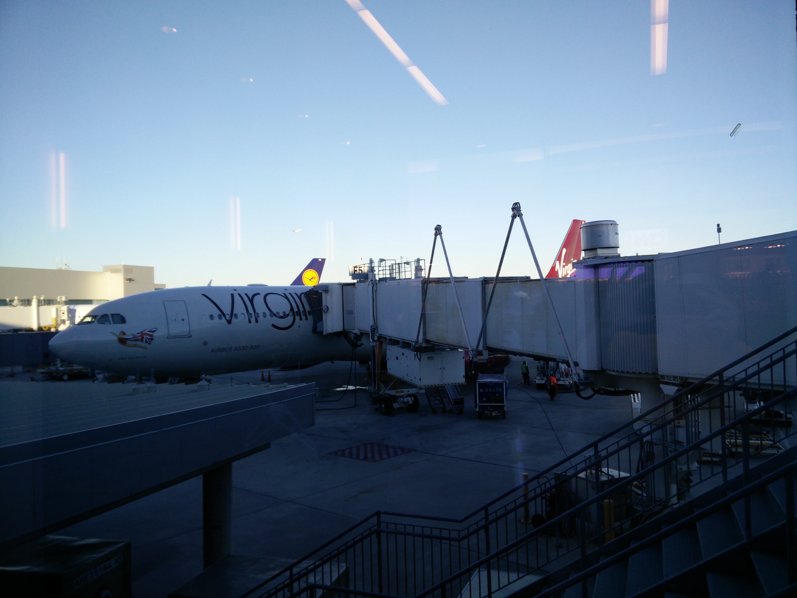

12/06 London
------------
######Sun Dec  6

We started our vacation with a 7 hour flight into Heathrow. Before we even checked in, I somehow managed to damage the two load bearing wheels on K's luggage. I think I did so by dragging my luggage on her rolling luggage. The combined weight of this was over 43K (94lbs). The remainder of the trip was uneventful. Upon landing we had to acquire Oyster cards since we left the ones we had prepurchased at home.

*I added the London Underground to list of mass transit I've used.*

After getting into our flat, we konked out for a much needed two hour nap since neither of us slept more than an hour on the flight over.

Waking up, a meal was in short order, regardless of calling it breakfast, lunch, or dinner. We stumbled into a little local street market and, after dodging numerous Brunch-goers, settled on crepes as our first meal. The things that go best with crepes are coffee and 9/11 truthers (apparently).

The highest value item on our Todo list was to visit the [John Snow pump](https://en.wikipedia.org/wiki/John_Snow_%28physician%29#Cholera). Much, much to K's dismay, the pump had been removed removed in August we think, and was not there.

One of the most different aspects so far is the fact that cars drive on the opposite side. I've even noticed this in the people. It seems like us humans seem to have the same collision avoidance delay, but british people try to pass on the opposite side when walking. This has caused numerous full stops when walking to avoid colliding. We've not managed to get run over yet. When ever we take buses we tried to ride on the upper level, purely for novelty and the view.

Dinner this evening was at Mother Mash, home of the best potatoes, sausages, and pies.

We stopped at a 24hr grocery store on the way back to the flat to pickup up some supplies for breakfast and general consumption. There were several neat house boats by St. Mary's canal. Most had some sort of solar panel, few had lights on the inside. It wasn't particularly late, I just assume people were out doing what people do when they're not in their houseboat.

Thanks to The Facebook, we caught wind of my mother's birthday party in progress and facetimed in to wish her well. Technology is grand sometimes. The damage to K's luggage bothered me enough to see what I could do about it by hand before resorting to a luggage repair place, or picking out new luggage. I was able to swap the front wheels with the back wheels. I hope this will hold up.

Day 1 - [Day 2](12-07-London.md)
