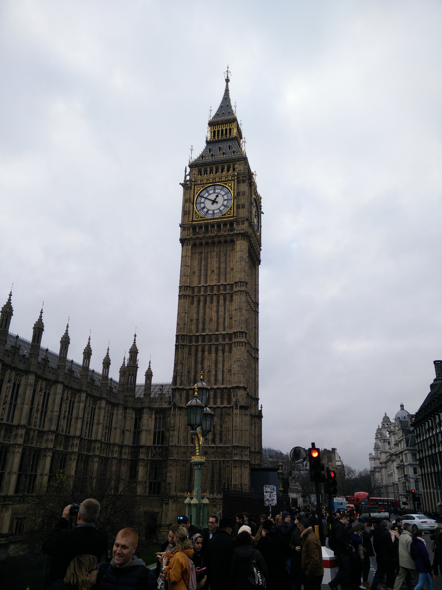
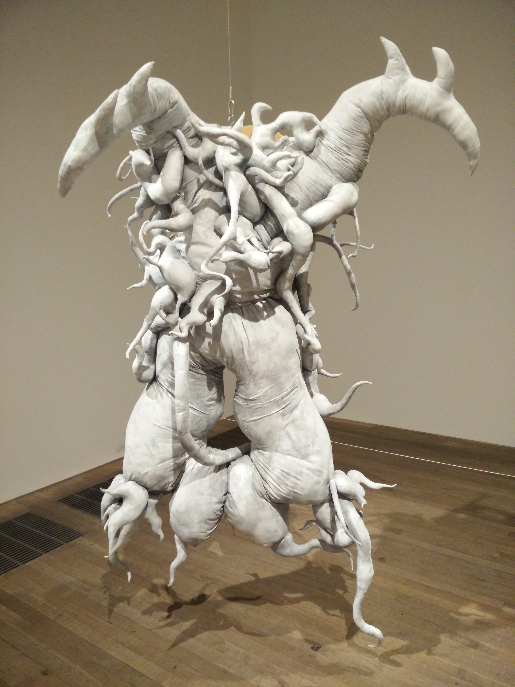
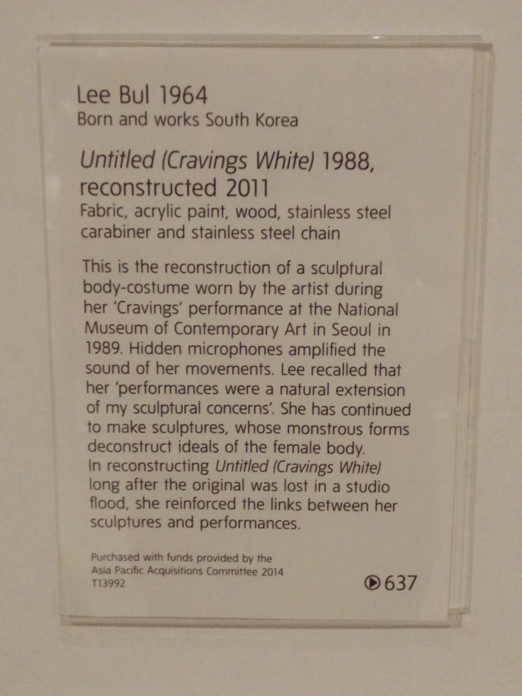
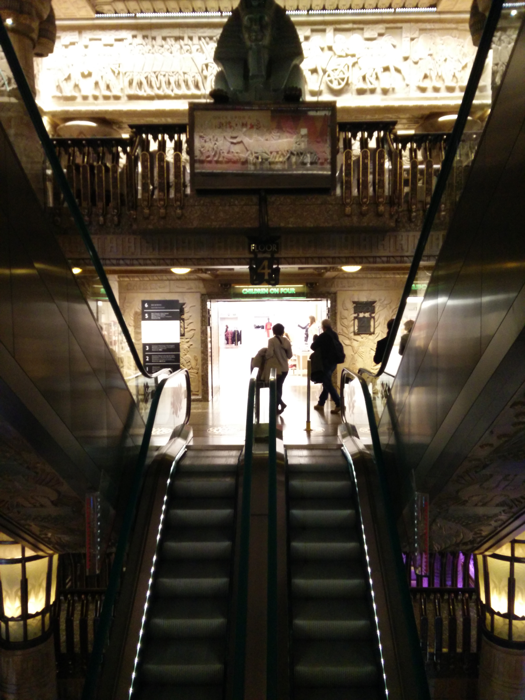

12/07 London
------------
######Mon Dec  7

We awoke after 12 hours of sleep. That's only fair given we technically had only 3 the night before. After figuring out the hot water, we both took showers. We had a nice breakfast of eggs, toast, and tea. Also, K cut up some persimmons for us.

We left the flat and started a [self guided walking tour](http://www.londonforfree.net/walks/bridges-walk/) K had found online. It started out at Big Ben. We left the tube station and searched around, but we didn't see the giant clock. After walking a little bit, we turned around and found the clock looming over us! We did most of the tour, walking two bridges, seeing a bunch of sights, and reading many facts to K. We walked past the London Eye on this tour but didn't go in.

We went to Leon for lunch, then Monmouth for Coffee. One of the presumed locals outside was quoted saying "One can have only so many tweed jackets." We then stopped into the Tate Modern and looked around.

I don't understand art. The Tate modern has a number of excellent childrens books. K's favorite exhibit was one about a small tropical country with portiats of people wearing masks made out of the local fruit. The reuse of the Tate Modern from a power station to an art museum is pretty neat as well. There was a Christmas Market outside and K just had to have some mulled wine.

We started to look for dinner and wandered past The Clink. Since the entire structure had been replaced since its original usage, we didn't go in. We walked by Shakespeare's Globe. We used the tube to get to dinner and got to experience it at rush hour. It's more crowded than Atlanta's transit system at rush hour!

I need to find a picture of the large lit globes across the street. I hope it's on one of our other cameras.

For dinner, we finally got fish and chips at ??? ! We weren't feeling terribly hungry so we decided to split a plate. Good thing we did, as the fish was large and came with plenty of chips (fries).

After dinner, K wanted to go to Harrods. Let me tell you that place is a maze! They have many floors, something for a restaurant on each, and multiple lifts and escalators going between each. Even one with an Egyptian theme:

We arrived at Harrods too late to get dessert, so we used Yelp to look elsewhere. We took a bus to a gelato place and split a few scoops there. We had a free bus ride back home, since the mass transit system has a daily cap. We hit this daily cap most days.

[Day 1](12-06-London.md) - Day 2 - [Day 3](12-08-London.md)
