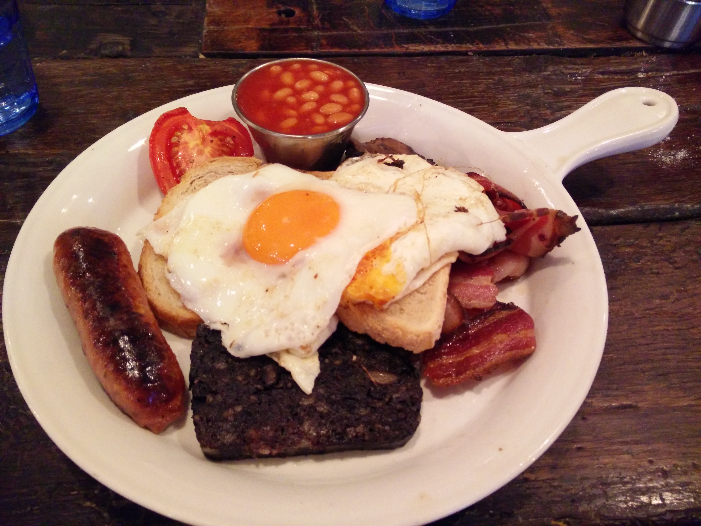
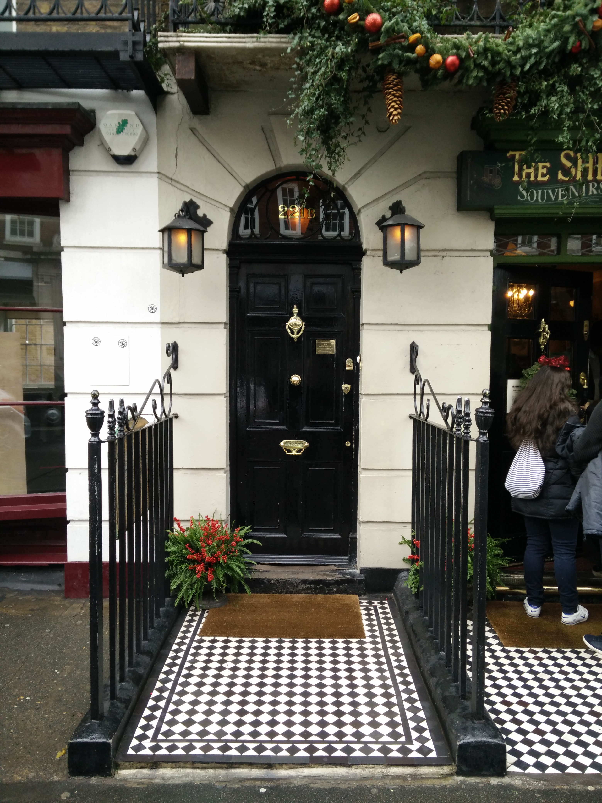
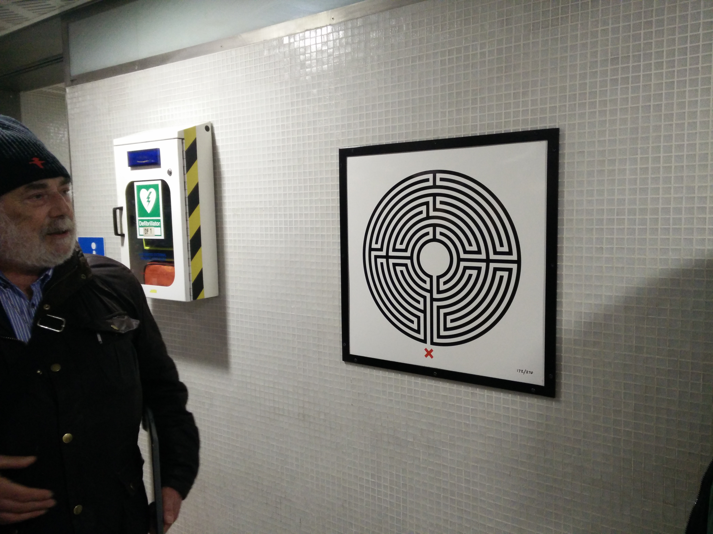
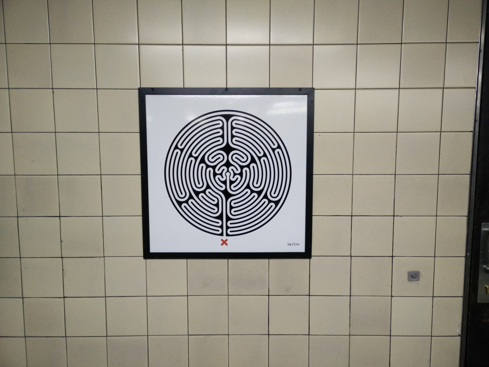
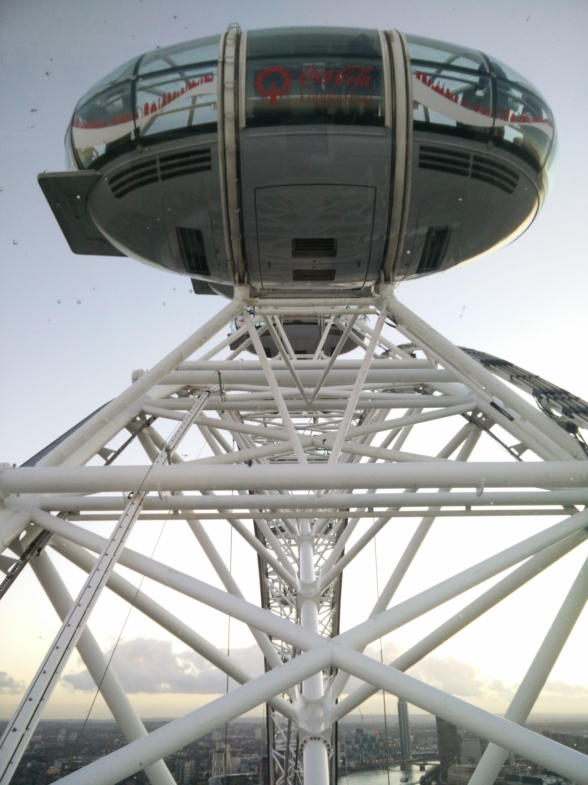
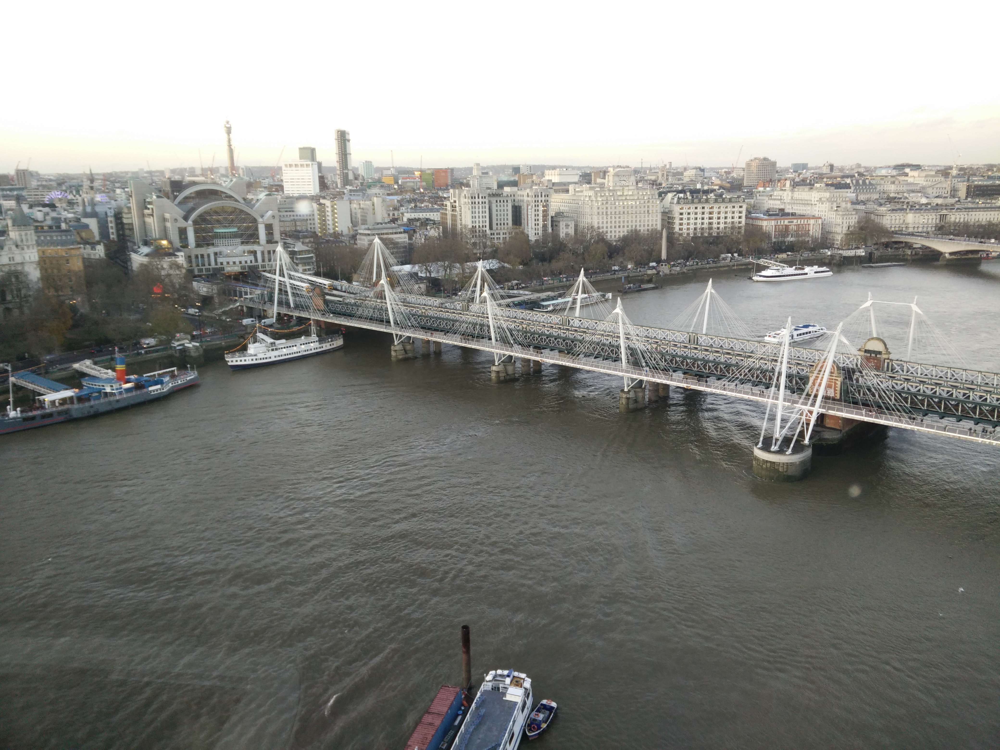
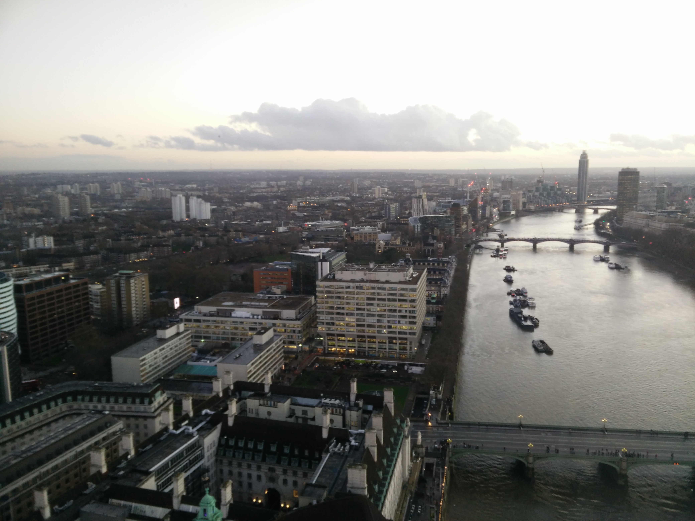
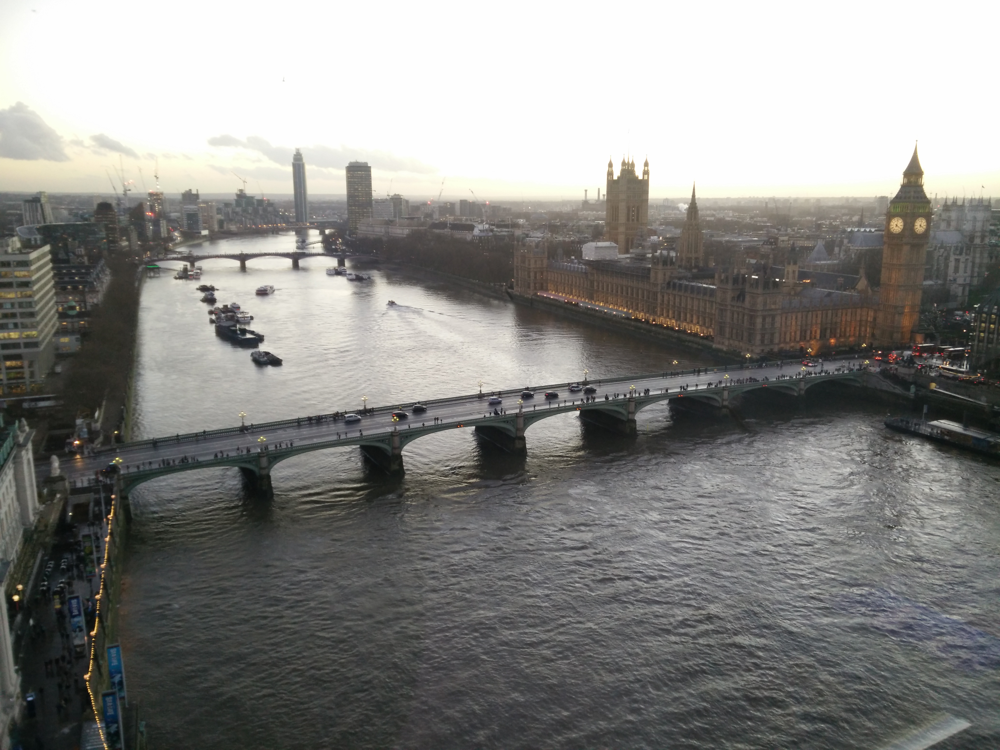
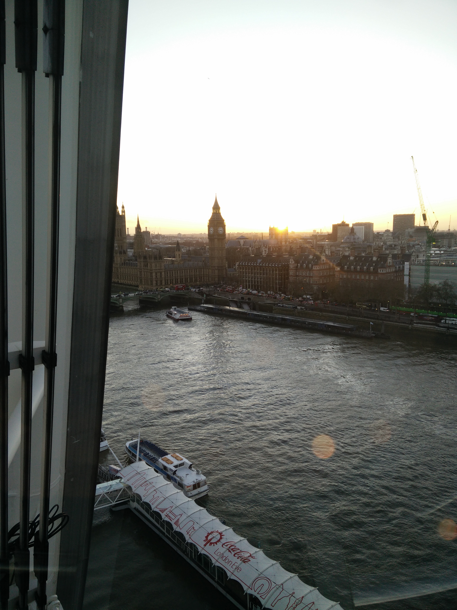
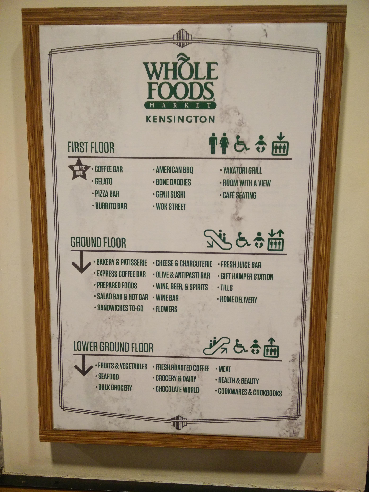

12/08 London
------------
######Tue Dec  8

This morning we left the flat early to feast on another one of London's token meals, A Full and Proper English Breakfast. There was a lot of meat. We finished up one postcard since we had enough time. We also got to experience the tube during the morning rush hour.

After breakfast we headed to the starting location of another tour. This also placed us very close to a famous address in London: 221B Baker Street.

Baker street didn't extend to this address when Sir Arthur Conan Doyle wrote about Sherlock Holmes, but when Baker street was extended, the museum was allowed to claim that address. Mr Holmes apparently still gets a lot of fan mail.

We went on a tour of London's Underground tube system. K took a bunch of notes.

> Baker Street 
> Metropolitan railway. Dream was Manchester to Paris.
>
> No windows in the original carriages. People smoked pipes. 
>
> Oldest subway in the world
> Busiest station Waterloo 
> Baker Street has the most platforms. (10)
> Last steam train to Baker Street 1967
> 
> Kings cross Saint pancreas 
> Northern line first deep underground. Used electricity. Company Generated their own power.
> 
> Circle line started as the different companies going two different ways.
> 
> 1947 government takes over railways
> 
> Kings cross station fire 1987. Deep underground trains pushing air through. 31 people died. Fireman didn't have a map. No one knew what was going on. Smoking then banned. Used to have 2 smoking carriages (1984)
> 
> Angels station longest escalator
> First escalator in earls court
> Deepest station hamstead 
> Average speed 20.5 mph. Fastest 60 mph on metropolitan line north of metro road.
> 
> Coventry Garden
> 15 floors underground
> Elevators only 
> Markets nearby. So became popular.
> One of busiest stations now
> Saturday's are exit only. Just renovated. 
> 
> About 40 closed stations. Stand station used for filming. 
> 
> Lester station and convent garden closest on the underground and most used by tourists
> 
> Leicester square station
> Deep underground stations used as shelters. Was discouraged at first but then used as official air raid shelters. Used to sleep on the tracks.
> December 1949 177,000 sheltered
> 
> Bethel green central line. Station wasn't done yet. 1943. Victoria park anti aircraft gun being tested. Bad communication. Air raid sirens started. Panic. Bethel green only had emergency spiral staircase without a rail. Steps wet. 173 people died. All suffocated. Government tried to cover it up. Worst civilian tragedy of wwii in London
> 
> Embankment station right by the river. Has big Gates down by the tracks to close off and save the station in case of flooding. 
> 
> On bakerloo line the tunnel was leaking and the built a fence around the tunnel and drained the river to fix the tunnel. Trains kept running.
> 
> 1980s Mind the gap started. Replaced at some point. Original mind the gap announcement in a few stations including embankment northbound platform 3. Dudes wife comes and listens to it. 
> Westminster newest station. Rebuilt for 2000. Line wasn't disrupted. Jubilee line new. 
> Big Ben 
> 
> Jubilee line has doors on the platform. They would like to do that everywhere but too expensive.

Each tube station has a map, created by an artist for one of the anniversaries. Pictured here are two of them:

We had a hearty lunch at The Cafe In The Crypt, under/next to the church, St. Martin-in-the-fields. After we headed back across the Waterloo bridge, one we had crossed the day before. It started to rain on our way to the London Eye, but we didn't turn back and continued as the rain wasn't very heavy. We took a 30 minute ride up and around the London Eye, taking many pictures of the sights around London from this unique vantage point.

I had wanted some [Clubemate](http://www.clubmate.de/) and I had found that Portobello Wholefoods was the only place close that had some. It was fast approaching their closing time, so we stopped by a closer Wholefoods and looked there with the intent of also getting something to make for dinner back at the flat.

The Wholefoods we found was enormous. Three levels, the top being a food court of sorts. We ended up just eating there. I got a burrito! We also picked up a few local beers for later in the week. Our local Wholefoods really needs to step up its game.

After Wholefoods, The Experience™, we returned to the flat.

[Day 2](12-07-London.md) - Day 3 - [Day 4](12-09-London.md)
